# Projects and dependencies analysis

This document provides a comprehensive overview of the projects and their dependencies in the context of upgrading to .NETCoreApp,Version=v10.0.

## Table of Contents

- [Executive Summary](#executive-Summary)
  - [Highlevel Metrics](#highlevel-metrics)
  - [Projects Compatibility](#projects-compatibility)
  - [Package Compatibility](#package-compatibility)
  - [API Compatibility](#api-compatibility)
- [Aggregate NuGet packages details](#aggregate-nuget-packages-details)
- [Top API Migration Challenges](#top-api-migration-challenges)
  - [Technologies and Features](#technologies-and-features)
  - [Most Frequent API Issues](#most-frequent-api-issues)
- [Projects Relationship Graph](#projects-relationship-graph)
- [Project Details](#project-details)

  - [Caliburn.Micro.Avalonia.Tests\Caliburn.Micro.Avalonia.Tests.csproj](#caliburnmicroavaloniatestscaliburnmicroavaloniatestscsproj)
  - [Caliburn.Micro.Avalonia\Caliburn.Micro.Avalonia.csproj](#caliburnmicroavaloniacaliburnmicroavaloniacsproj)
  - [Caliburn.Micro.Core.Tests\Caliburn.Micro.Core.Tests.csproj](#caliburnmicrocoretestscaliburnmicrocoretestscsproj)
  - [Caliburn.Micro.Core\Caliburn.Micro.Core.csproj](#caliburnmicrocorecaliburnmicrocorecsproj)
  - [Caliburn.Micro.Maui.Tests\Caliburn.Micro.Maui.Tests.csproj](#caliburnmicromauitestscaliburnmicromauitestscsproj)
  - [Caliburn.Micro.Maui\Caliburn.Micro.Maui.csproj](#caliburnmicromauicaliburnmicromauicsproj)
  - [Caliburn.Micro.Platform.Core\Caliburn.Micro.Platform.Core.csproj](#caliburnmicroplatformcorecaliburnmicroplatformcorecsproj)
  - [Caliburn.Micro.Platform.Tests\Caliburn.Micro.Platform.Tests.csproj](#caliburnmicroplatformtestscaliburnmicroplatformtestscsproj)
  - [Caliburn.Micro.Platform\Caliburn.Micro.Platform.csproj](#caliburnmicroplatformcaliburnmicroplatformcsproj)
  - [Caliburn.Micro.WinUI3\Caliburn.Micro.WinUI3.csproj](#caliburnmicrowinui3caliburnmicrowinui3csproj)
  - [Caliburn.Micro.Xamarin.Forms\Caliburn.Micro.Xamarin.Forms.csproj](#caliburnmicroxamarinformscaliburnmicroxamarinformscsproj)

## Executive Summary

### Highlevel Metrics

| Metric | Count | Status |
| :--- | :---: | :--- |
| Total Projects | 11 | 9 require upgrade |
| Total NuGet Packages | 26 | 3 need upgrade |
| Total Code Files | 286 |  |
| Total Code Files with Incidents | 61 |  |
| Total Lines of Code | 43273 |  |
| Total Number of Issues | 1648 |  |
| Estimated LOC to modify | 1633+ | at least 3.8% of codebase |

### Projects Compatibility

| Project | Target Framework | Difficulty | Package Issues | API Issues | Est. LOC Impact | Description |
| :--- | :---: | :---: | :---: | :---: | :---: | :--- |
| [Caliburn.Micro.Avalonia.Tests\Caliburn.Micro.Avalonia.Tests.csproj](#caliburnmicroavaloniatestscaliburnmicroavaloniatestscsproj) | net8.0 | 🟢 Low | 1 | 2 | 2+ | DotNetCoreApp, Sdk Style = True |
| [Caliburn.Micro.Avalonia\Caliburn.Micro.Avalonia.csproj](#caliburnmicroavaloniacaliburnmicroavaloniacsproj) | net8.0 | 🟢 Low | 0 | 0 |  | ClassLibrary, Sdk Style = True |
| [Caliburn.Micro.Core.Tests\Caliburn.Micro.Core.Tests.csproj](#caliburnmicrocoretestscaliburnmicrocoretestscsproj) | net8.0 | 🟢 Low | 1 | 4 | 4+ | DotNetCoreApp, Sdk Style = True |
| [Caliburn.Micro.Core\Caliburn.Micro.Core.csproj](#caliburnmicrocorecaliburnmicrocorecsproj) | netstandard2.0 | ✅ None | 0 | 0 |  | ClassLibrary, Sdk Style = True |
| [Caliburn.Micro.Maui.Tests\Caliburn.Micro.Maui.Tests.csproj](#caliburnmicromauitestscaliburnmicromauitestscsproj) | net9.0 | 🟢 Low | 1 | 38 | 38+ | DotNetCoreApp, Sdk Style = True |
| [Caliburn.Micro.Maui\Caliburn.Micro.Maui.csproj](#caliburnmicromauicaliburnmicromauicsproj) | net9.0;net9.0-android;net9.0-ios;net9.0-maccatalyst;net9.0-windows10.0.19041 | 🟢 Low | 0 | 515 | 515+ | ClassLibrary, Sdk Style = True |
| [Caliburn.Micro.Platform.Core\Caliburn.Micro.Platform.Core.csproj](#caliburnmicroplatformcorecaliburnmicroplatformcorecsproj) | netstandard2.0 | ✅ None | 0 | 0 |  | ClassLibrary, Sdk Style = True |
| [Caliburn.Micro.Platform.Tests\Caliburn.Micro.Platform.Tests.csproj](#caliburnmicroplatformtestscaliburnmicroplatformtestscsproj) | net8.0-windows | 🟡 Medium | 2 | 73 | 73+ | Wpf, Sdk Style = True |
| [Caliburn.Micro.Platform\Caliburn.Micro.Platform.csproj](#caliburnmicroplatformcaliburnmicroplatformcsproj) | net462;uap10.0.19041;net9.0-android;net9.0-ios;net8.0-windows;net9.0-windows | 🟡 Medium | 1 | 969 | 969+ | Wpf, Sdk Style = True |
| [Caliburn.Micro.WinUI3\Caliburn.Micro.WinUI3.csproj](#caliburnmicrowinui3caliburnmicrowinui3csproj) | net9.0-windows10.0.19041.0;net10.0-windows10.0.19041.0 | 🟢 Low | 1 | 30 | 30+ | WinUI, Sdk Style = True |
| [Caliburn.Micro.Xamarin.Forms\Caliburn.Micro.Xamarin.Forms.csproj](#caliburnmicroxamarinformscaliburnmicroxamarinformscsproj) | netstandard2.0 | 🟢 Low | 1 | 2 | 2+ | ClassLibrary, Sdk Style = True |

### Package Compatibility

| Status | Count | Percentage |
| :--- | :---: | :---: |
| ✅ Compatible | 23 | 88.5% |
| ⚠️ Incompatible | 3 | 11.5% |
| 🔄 Upgrade Recommended | 0 | 0.0% |
| ***Total NuGet Packages*** | ***26*** | ***100%*** |

### API Compatibility

| Category | Count | Impact |
| :--- | :---: | :--- |
| 🔴 Binary Incompatible | 1032 | High - Require code changes |
| 🟡 Source Incompatible | 564 | Medium - Needs re-compilation and potential conflicting API error fixing |
| 🔵 Behavioral change | 37 | Low - Behavioral changes that may require testing at runtime |
| ✅ Compatible | 18313 |  |
| ***Total APIs Analyzed*** | ***19946*** |  |

## Aggregate NuGet packages details

| Package | Current Version | Suggested Version | Projects | Description |
| :--- | :---: | :---: | :--- | :--- |
| Avalonia | 11.3.5 |  | [Caliburn.Micro.Avalonia.csproj](#caliburnmicroavaloniacaliburnmicroavaloniacsproj) [Caliburn.Micro.Avalonia.Tests.csproj](#caliburnmicroavaloniatestscaliburnmicroavaloniatestscsproj) | ✅Compatible |
| Avalonia.Desktop | 11.3.5 |  | [Caliburn.Micro.Avalonia.csproj](#caliburnmicroavaloniacaliburnmicroavaloniacsproj) [Caliburn.Micro.Avalonia.Tests.csproj](#caliburnmicroavaloniatestscaliburnmicroavaloniatestscsproj) | ✅Compatible |
| Avalonia.Diagnostics | 11.3.5 |  | [Caliburn.Micro.Avalonia.csproj](#caliburnmicroavaloniacaliburnmicroavaloniacsproj) [Caliburn.Micro.Avalonia.Tests.csproj](#caliburnmicroavaloniatestscaliburnmicroavaloniatestscsproj) | ✅Compatible |
| Avalonia.Markup.Xaml.Loader | 11.3.5 |  | [Caliburn.Micro.Avalonia.csproj](#caliburnmicroavaloniacaliburnmicroavaloniacsproj) [Caliburn.Micro.Avalonia.Tests.csproj](#caliburnmicroavaloniatestscaliburnmicroavaloniatestscsproj) | ✅Compatible |
| coverlet.collector | 6.0.2 |  | [Caliburn.Micro.Avalonia.Tests.csproj](#caliburnmicroavaloniatestscaliburnmicroavaloniatestscsproj) [Caliburn.Micro.Core.Tests.csproj](#caliburnmicrocoretestscaliburnmicrocoretestscsproj) [Caliburn.Micro.Maui.Tests.csproj](#caliburnmicromauitestscaliburnmicromauitestscsproj) [Caliburn.Micro.Platform.Tests.csproj](#caliburnmicroplatformtestscaliburnmicroplatformtestscsproj) | ✅Compatible |
| coverlet.msbuild | 6.0.2 |  | [Caliburn.Micro.Avalonia.Tests.csproj](#caliburnmicroavaloniatestscaliburnmicroavaloniatestscsproj) [Caliburn.Micro.Core.Tests.csproj](#caliburnmicrocoretestscaliburnmicrocoretestscsproj) [Caliburn.Micro.Platform.Tests.csproj](#caliburnmicroplatformtestscaliburnmicroplatformtestscsproj) | ✅Compatible |
| Microsoft.Maui.Controls | 9.0.120 |  | [Caliburn.Micro.Maui.csproj](#caliburnmicromauicaliburnmicromauicsproj) [Caliburn.Micro.Maui.Tests.csproj](#caliburnmicromauitestscaliburnmicromauitestscsproj) | ✅Compatible |
| Microsoft.NET.Test.Sdk | 17.12.0 |  | [Caliburn.Micro.Avalonia.Tests.csproj](#caliburnmicroavaloniatestscaliburnmicroavaloniatestscsproj) [Caliburn.Micro.Core.Tests.csproj](#caliburnmicrocoretestscaliburnmicrocoretestscsproj) [Caliburn.Micro.Maui.Tests.csproj](#caliburnmicromauitestscaliburnmicromauitestscsproj) [Caliburn.Micro.Platform.Tests.csproj](#caliburnmicroplatformtestscaliburnmicroplatformtestscsproj) | ✅Compatible |
| Microsoft.NETFramework.ReferenceAssemblies | 1.0.2 |  | [Caliburn.Micro.Platform.csproj](#caliburnmicroplatformcaliburnmicroplatformcsproj) | ✅Compatible |
| Microsoft.SourceLink.GitHub | 1.0.0 |  | [Caliburn.Micro.WinUI3.csproj](#caliburnmicrowinui3caliburnmicrowinui3csproj) | ✅Compatible |
| Microsoft.SourceLink.GitHub | 8.0.0 |  | [Caliburn.Micro.Avalonia.csproj](#caliburnmicroavaloniacaliburnmicroavaloniacsproj) [Caliburn.Micro.Core.csproj](#caliburnmicrocorecaliburnmicrocorecsproj) [Caliburn.Micro.Maui.csproj](#caliburnmicromauicaliburnmicromauicsproj) [Caliburn.Micro.Platform.Core.csproj](#caliburnmicroplatformcorecaliburnmicroplatformcorecsproj) [Caliburn.Micro.Platform.csproj](#caliburnmicroplatformcaliburnmicroplatformcsproj) [Caliburn.Micro.Xamarin.Forms.csproj](#caliburnmicroxamarinformscaliburnmicroxamarinformscsproj) | ✅Compatible |
| Microsoft.Windows.SDK.BuildTools | 10.0.26100.4654 |  | [Caliburn.Micro.WinUI3.csproj](#caliburnmicrowinui3caliburnmicrowinui3csproj) | ✅Compatible |
| Microsoft.WindowsAppSDK | 1.8.250907003 |  | [Caliburn.Micro.WinUI3.csproj](#caliburnmicrowinui3caliburnmicrowinui3csproj) | ✅Compatible |
| Microsoft.Xaml.Behaviors.WinUI.Managed | 2.0.9 |  | [Caliburn.Micro.WinUI3.csproj](#caliburnmicrowinui3caliburnmicrowinui3csproj) | ⚠️NuGet package is incompatible |
| Microsoft.Xaml.Behaviors.Wpf | 1.1.135 | 1.1.39 | [Caliburn.Micro.Platform.csproj](#caliburnmicroplatformcaliburnmicroplatformcsproj) [Caliburn.Micro.Platform.Tests.csproj](#caliburnmicroplatformtestscaliburnmicroplatformtestscsproj) | ⚠️NuGet package is incompatible |
| Moq | 4.20.72 |  | [Caliburn.Micro.Avalonia.Tests.csproj](#caliburnmicroavaloniatestscaliburnmicroavaloniatestscsproj) [Caliburn.Micro.Core.Tests.csproj](#caliburnmicrocoretestscaliburnmicrocoretestscsproj) [Caliburn.Micro.Maui.Tests.csproj](#caliburnmicromauitestscaliburnmicromauitestscsproj) [Caliburn.Micro.Platform.Tests.csproj](#caliburnmicroplatformtestscaliburnmicroplatformtestscsproj) | ✅Compatible |
| Nerdbank.GitVersioning | 3.3.37 |  | [Caliburn.Micro.WinUI3.csproj](#caliburnmicrowinui3caliburnmicrowinui3csproj) | ✅Compatible |
| Nerdbank.GitVersioning | 3.7.112 |  | [Caliburn.Micro.Avalonia.csproj](#caliburnmicroavaloniacaliburnmicroavaloniacsproj) [Caliburn.Micro.Avalonia.Tests.csproj](#caliburnmicroavaloniatestscaliburnmicroavaloniatestscsproj) [Caliburn.Micro.Core.csproj](#caliburnmicrocorecaliburnmicrocorecsproj) [Caliburn.Micro.Core.Tests.csproj](#caliburnmicrocoretestscaliburnmicrocoretestscsproj) [Caliburn.Micro.Maui.csproj](#caliburnmicromauicaliburnmicromauicsproj) [Caliburn.Micro.Maui.Tests.csproj](#caliburnmicromauitestscaliburnmicromauitestscsproj) [Caliburn.Micro.Platform.Core.csproj](#caliburnmicroplatformcorecaliburnmicroplatformcorecsproj) [Caliburn.Micro.Platform.csproj](#caliburnmicroplatformcaliburnmicroplatformcsproj) [Caliburn.Micro.Platform.Tests.csproj](#caliburnmicroplatformtestscaliburnmicroplatformtestscsproj) [Caliburn.Micro.Xamarin.Forms.csproj](#caliburnmicroxamarinformscaliburnmicroxamarinformscsproj) | ✅Compatible |
| NETStandard.Library | 2.0.3 |  | [Caliburn.Micro.Core.csproj](#caliburnmicrocorecaliburnmicrocorecsproj) [Caliburn.Micro.Platform.Core.csproj](#caliburnmicroplatformcorecaliburnmicroplatformcorecsproj) [Caliburn.Micro.Xamarin.Forms.csproj](#caliburnmicroxamarinformscaliburnmicroxamarinformscsproj) | ✅Compatible |
| System.Reactive | 6.0.1 |  | [Caliburn.Micro.Avalonia.csproj](#caliburnmicroavaloniacaliburnmicroavaloniacsproj) [Caliburn.Micro.Avalonia.Tests.csproj](#caliburnmicroavaloniatestscaliburnmicroavaloniatestscsproj) | ✅Compatible |
| Xamarin.Forms | 5.0.0.2662 |  | [Caliburn.Micro.Xamarin.Forms.csproj](#caliburnmicroxamarinformscaliburnmicroxamarinformscsproj) | NuGet package functionality is included with framework reference |
| Xaml.Behaviors.Avalonia | 11.3.2 |  | [Caliburn.Micro.Avalonia.csproj](#caliburnmicroavaloniacaliburnmicroavaloniacsproj) [Caliburn.Micro.Avalonia.Tests.csproj](#caliburnmicroavaloniatestscaliburnmicroavaloniatestscsproj) | ✅Compatible |
| Xaml.Behaviors.Interactivity | 11.3.2 |  | [Caliburn.Micro.Avalonia.csproj](#caliburnmicroavaloniacaliburnmicroavaloniacsproj) [Caliburn.Micro.Avalonia.Tests.csproj](#caliburnmicroavaloniatestscaliburnmicroavaloniatestscsproj) | ✅Compatible |
| xunit | 2.9.2 |  | [Caliburn.Micro.Avalonia.Tests.csproj](#caliburnmicroavaloniatestscaliburnmicroavaloniatestscsproj) [Caliburn.Micro.Core.Tests.csproj](#caliburnmicrocoretestscaliburnmicrocoretestscsproj) [Caliburn.Micro.Maui.Tests.csproj](#caliburnmicromauitestscaliburnmicromauitestscsproj) [Caliburn.Micro.Platform.Tests.csproj](#caliburnmicroplatformtestscaliburnmicroplatformtestscsproj) | ⚠️NuGet package is deprecated |
| xunit.runner.visualstudio | 2.8.2 |  | [Caliburn.Micro.Avalonia.Tests.csproj](#caliburnmicroavaloniatestscaliburnmicroavaloniatestscsproj) [Caliburn.Micro.Core.Tests.csproj](#caliburnmicrocoretestscaliburnmicrocoretestscsproj) [Caliburn.Micro.Maui.Tests.csproj](#caliburnmicromauitestscaliburnmicromauitestscsproj) [Caliburn.Micro.Platform.Tests.csproj](#caliburnmicroplatformtestscaliburnmicroplatformtestscsproj) | ✅Compatible |
| Xunit.StaFact | 1.1.11 |  | [Caliburn.Micro.Avalonia.Tests.csproj](#caliburnmicroavaloniatestscaliburnmicroavaloniatestscsproj) [Caliburn.Micro.Platform.Tests.csproj](#caliburnmicroplatformtestscaliburnmicroplatformtestscsproj) | ✅Compatible |

## Top API Migration Challenges

### Technologies and Features

| Technology | Issues | Percentage | Migration Path |
| :--- | :---: | :---: | :--- |
| WPF (Windows Presentation Foundation) | 388 | 23.8% | WPF APIs for building Windows desktop applications with XAML-based UI that are available in .NET on Windows. WPF provides rich desktop UI capabilities with data binding and styling. Enable Windows Desktop support: Option 1 (Recommended): Target net9.0-windows; Option 2: Add <UseWindowsDesktop>true</UseWindowsDesktop>. |

### Most Frequent API Issues

| API | Count | Percentage | Category |
| :--- | :---: | :---: | :--- |
| T:System.Windows.DependencyProperty | 163 | 10.0% | Binary Incompatible |
| T:Microsoft.Maui.Controls.BindableProperty | 128 | 7.8% | Source Incompatible |
| T:System.Windows.DependencyObject | 91 | 5.6% | Binary Incompatible |
| T:Microsoft.Maui.Controls.BindableObject | 73 | 4.5% | Source Incompatible |
| T:Microsoft.Maui.Controls.BindingMode | 42 | 2.6% | Source Incompatible |
| T:System.Windows.FrameworkElement | 37 | 2.3% | Binary Incompatible |
| T:Microsoft.Maui.Controls.VisualElement | 32 | 2.0% | Source Incompatible |
| T:System.Windows.Controls.Frame | 32 | 2.0% | Binary Incompatible |
| T:System.Windows.Window | 30 | 1.8% | Binary Incompatible |
| T:System.Uri | 29 | 1.8% | Behavioral Change |
| T:Microsoft.Maui.Controls.NavigationPage | 26 | 1.6% | Source Incompatible |
| T:System.Windows.Controls.ItemsControl | 26 | 1.6% | Binary Incompatible |
| M:System.Windows.DependencyObject.SetValue(System.Windows.DependencyProperty,System.Object) | 25 | 1.5% | Binary Incompatible |
| P:System.Windows.DependencyPropertyChangedEventArgs.NewValue | 22 | 1.3% | Binary Incompatible |
| P:System.Windows.FrameworkElement.Name | 20 | 1.2% | Binary Incompatible |
| F:System.Windows.Controls.ItemsControl.ItemsSourceProperty | 20 | 1.2% | Binary Incompatible |
| M:System.Windows.DependencyObject.GetValue(System.Windows.DependencyProperty) | 19 | 1.2% | Binary Incompatible |
| M:System.Windows.DependencyObject.#ctor | 19 | 1.2% | Binary Incompatible |
| T:System.Windows.UIElement | 18 | 1.1% | Binary Incompatible |
| T:Microsoft.Maui.Controls.Page | 17 | 1.0% | Source Incompatible |
| T:System.Windows.Navigation.NavigatingCancelEventHandler | 17 | 1.0% | Binary Incompatible |
| M:Microsoft.Maui.Controls.BindableObject.GetValue(Microsoft.Maui.Controls.BindableProperty) | 16 | 1.0% | Source Incompatible |
| M:Microsoft.Maui.Controls.BindableObject.SetValue(Microsoft.Maui.Controls.BindableProperty,System.Object) | 16 | 1.0% | Source Incompatible |
| T:System.Windows.Navigation.NavigatedEventHandler | 14 | 0.9% | Binary Incompatible |
| T:System.Windows.DataTemplate | 14 | 0.9% | Binary Incompatible |
| T:System.Windows.RoutedEventHandler | 14 | 0.9% | Binary Incompatible |
| T:System.Windows.Application | 13 | 0.8% | Binary Incompatible |
| T:System.Windows.Threading.Dispatcher | 13 | 0.8% | Binary Incompatible |
| T:System.Windows.DependencyPropertyChangedEventArgs | 12 | 0.7% | Binary Incompatible |
| T:Microsoft.Maui.Controls.Element | 11 | 0.7% | Source Incompatible |
| F:System.Windows.UIElement.VisibilityProperty | 10 | 0.6% | Binary Incompatible |
| T:System.Windows.Controls.ContentControl | 10 | 0.6% | Binary Incompatible |
| F:System.Windows.Controls.ContentControl.ContentProperty | 10 | 0.6% | Binary Incompatible |
| T:System.Windows.Navigation.FragmentNavigationEventHandler | 8 | 0.5% | Binary Incompatible |
| T:System.Windows.Navigation.NavigationStoppedEventHandler | 8 | 0.5% | Binary Incompatible |
| T:System.Windows.Navigation.NavigationFailedEventHandler | 8 | 0.5% | Binary Incompatible |
| T:System.Windows.Data.BindingMode | 8 | 0.5% | Binary Incompatible |
| P:Microsoft.Maui.Controls.NavigationPage.CurrentPage | 7 | 0.4% | Source Incompatible |
| P:System.Windows.Controls.ContentControl.Content | 7 | 0.4% | Binary Incompatible |
| T:Windows.UI.Color | 7 | 0.4% | Source Incompatible |
| M:System.TimeSpan.FromSeconds(System.Double) | 6 | 0.4% | Source Incompatible |
| F:Microsoft.Maui.Controls.BindingMode.TwoWay | 6 | 0.4% | Source Incompatible |
| F:Microsoft.Maui.Controls.BindingMode.OneWayToSource | 6 | 0.4% | Source Incompatible |
| P:System.Windows.DependencyPropertyChangedEventArgs.OldValue | 6 | 0.4% | Binary Incompatible |
| T:System.Windows.Controls.Page | 6 | 0.4% | Binary Incompatible |
| T:System.Windows.WindowStartupLocation | 6 | 0.4% | Binary Incompatible |
| T:System.Windows.Controls.Primitives.PlacementMode | 6 | 0.4% | Binary Incompatible |
| P:Microsoft.Maui.Controls.BindableObject.BindingContext | 5 | 0.3% | Source Incompatible |
| M:System.Uri.#ctor(System.String) | 5 | 0.3% | Behavioral Change |
| T:Microsoft.Maui.Controls.DataTemplate | 5 | 0.3% | Source Incompatible |

## Projects Relationship Graph

Legend:
📦 SDK-style project
⚙️ Classic project

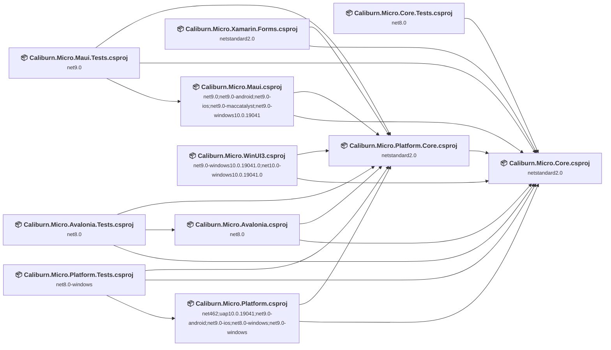

## Project Details

### Caliburn.Micro.Avalonia.Tests\Caliburn.Micro.Avalonia.Tests.csproj

#### Project Info

- **Current Target Framework:** net8.0
- **Proposed Target Framework:** net10.0
- **SDK-style**: True
- **Project Kind:** DotNetCoreApp
- **Dependencies**: 3
- **Dependants**: 0
- **Number of Files**: 12
- **Number of Files with Incidents**: 2
- **Lines of Code**: 689
- **Estimated LOC to modify**: 2+ (at least 0.3% of the project)

#### Dependency Graph

Legend:
📦 SDK-style project
⚙️ Classic project

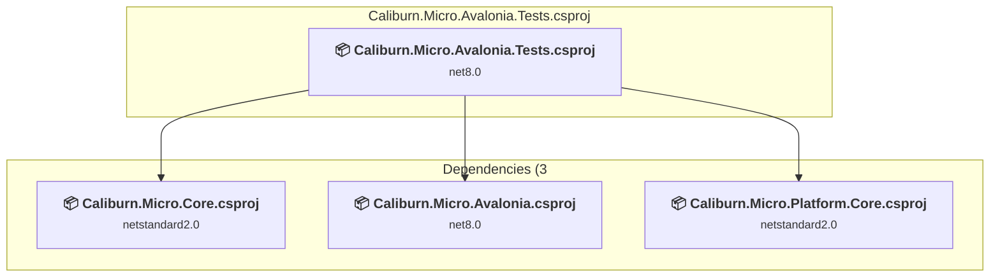

### API Compatibility

| Category | Count | Impact |
| :--- | :---: | :--- |
| 🔴 Binary Incompatible | 0 | High - Require code changes |
| 🟡 Source Incompatible | 2 | Medium - Needs re-compilation and potential conflicting API error fixing |
| 🔵 Behavioral change | 0 | Low - Behavioral changes that may require testing at runtime |
| ✅ Compatible | 609 |  |
| ***Total APIs Analyzed*** | ***611*** |  |

### Caliburn.Micro.Avalonia\Caliburn.Micro.Avalonia.csproj

#### Project Info

- **Current Target Framework:** net8.0
- **Proposed Target Framework:** net10.0
- **SDK-style**: True
- **Project Kind:** ClassLibrary
- **Dependencies**: 2
- **Dependants**: 1
- **Number of Files**: 31
- **Number of Files with Incidents**: 1
- **Lines of Code**: 7320
- **Estimated LOC to modify**: 0+ (at least 0.0% of the project)

#### Dependency Graph

Legend:
📦 SDK-style project
⚙️ Classic project

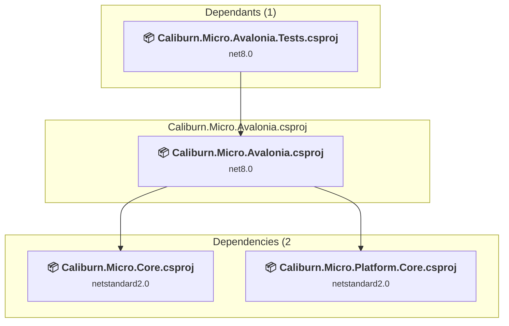

### API Compatibility

| Category | Count | Impact |
| :--- | :---: | :--- |
| 🔴 Binary Incompatible | 0 | High - Require code changes |
| 🟡 Source Incompatible | 0 | Medium - Needs re-compilation and potential conflicting API error fixing |
| 🔵 Behavioral change | 0 | Low - Behavioral changes that may require testing at runtime |
| ✅ Compatible | 3164 |  |
| ***Total APIs Analyzed*** | ***3164*** |  |

### Caliburn.Micro.Core.Tests\Caliburn.Micro.Core.Tests.csproj

#### Project Info

- **Current Target Framework:** net8.0
- **Proposed Target Framework:** net10.0
- **SDK-style**: True
- **Project Kind:** DotNetCoreApp
- **Dependencies**: 1
- **Dependants**: 0
- **Number of Files**: 31
- **Number of Files with Incidents**: 3
- **Lines of Code**: 1406
- **Estimated LOC to modify**: 4+ (at least 0.3% of the project)

#### Dependency Graph

Legend:
📦 SDK-style project
⚙️ Classic project

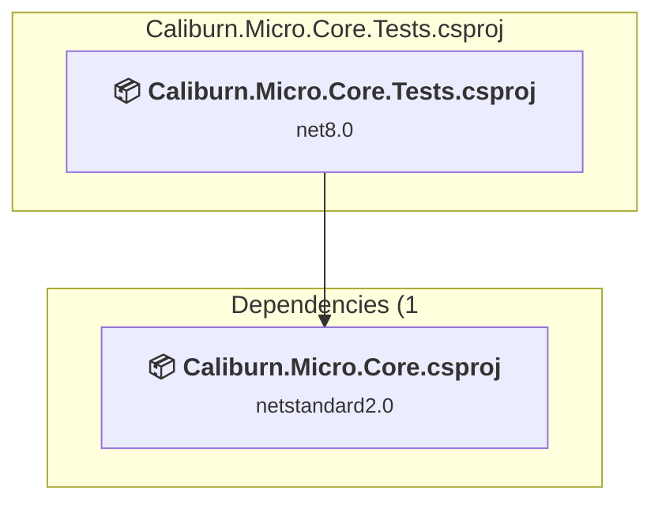

### API Compatibility

| Category | Count | Impact |
| :--- | :---: | :--- |
| 🔴 Binary Incompatible | 0 | High - Require code changes |
| 🟡 Source Incompatible | 4 | Medium - Needs re-compilation and potential conflicting API error fixing |
| 🔵 Behavioral change | 0 | Low - Behavioral changes that may require testing at runtime |
| ✅ Compatible | 1100 |  |
| ***Total APIs Analyzed*** | ***1104*** |  |

### Caliburn.Micro.Core\Caliburn.Micro.Core.csproj

#### Project Info

- **Current Target Framework:** netstandard2.0✅
- **SDK-style**: True
- **Project Kind:** ClassLibrary
- **Dependencies**: 0
- **Dependants**: 10
- **Number of Files**: 67
- **Lines of Code**: 4924
- **Estimated LOC to modify**: 0+ (at least 0.0% of the project)

#### Dependency Graph

Legend:
📦 SDK-style project
⚙️ Classic project

```mermaid
flowchart TB
    subgraph upstream["Dependants (10)"]
        P2["<b>📦&nbsp;Caliburn.Micro.Platform.csproj</b><br/><small>net462;uap10.0.19041;net9.0-android;net9.0-ios;net8.0-windows;net9.0-windows</small>"]
        P3["<b>📦&nbsp;Caliburn.Micro.Core.Tests.csproj</b><br/><small>net8.0</small>"]
        P4["<b>📦&nbsp;Caliburn.Micro.Platform.Tests.csproj</b><br/><small>net8.0-windows</small>"]
        P5["<b>📦&nbsp;Caliburn.Micro.Platform.Core.csproj</b><br/><small>netstandard2.0</small>"]
        P6["<b>📦&nbsp;Caliburn.Micro.Xamarin.Forms.csproj</b><br/><small>netstandard2.0</small>"]
        P7["<b>📦&nbsp;Caliburn.Micro.Maui.csproj</b><br/><small>net9.0;net9.0-android;net9.0-ios;net9.0-maccatalyst;net9.0-windows10.0.19041</small>"]
        P8["<b>📦&nbsp;Caliburn.Micro.Avalonia.csproj</b><br/><small>net8.0</small>"]
        P9["<b>📦&nbsp;Caliburn.Micro.Avalonia.Tests.csproj</b><br/><small>net8.0</small>"]
        P10["<b>📦&nbsp;Caliburn.Micro.Maui.Tests.csproj</b><br/><small>net9.0</small>"]
        P11["<b>📦&nbsp;Caliburn.Micro.WinUI3.csproj</b><br/><small>net9.0-windows10.0.19041.0;net10.0-windows10.0.19041.0</small>"]
        click P2 "#caliburnmicroplatformcaliburnmicroplatformcsproj"
        click P3 "#caliburnmicrocoretestscaliburnmicrocoretestscsproj"
        click P4 "#caliburnmicroplatformtestscaliburnmicroplatformtestscsproj"
        click P5 "#caliburnmicroplatformcorecaliburnmicroplatformcorecsproj"
        click P6 "#caliburnmicroxamarinformscaliburnmicroxamarinformscsproj"
        click P7 "#caliburnmicromauicaliburnmicromauicsproj"
        click P8 "#caliburnmicroavaloniacaliburnmicroavaloniacsproj"
        click P9 "#caliburnmicroavaloniatestscaliburnmicroavaloniatestscsproj"
        click P10 "#caliburnmicromauitestscaliburnmicromauitestscsproj"
        click P11 "#caliburnmicrowinui3caliburnmicrowinui3csproj"
    end
    subgraph current["Caliburn.Micro.Core.csproj"]
        MAIN["<b>📦&nbsp;Caliburn.Micro.Core.csproj</b><br/><small>netstandard2.0</small>"]
        click MAIN "#caliburnmicrocorecaliburnmicrocorecsproj"
    end
    P2 --> MAIN
    P3 --> MAIN
    P4 --> MAIN
    P5 --> MAIN
    P6 --> MAIN
    P7 --> MAIN
    P8 --> MAIN
    P9 --> MAIN
    P10 --> MAIN
    P11 --> MAIN

```

### API Compatibility

| Category | Count | Impact |
| :--- | :---: | :--- |
| 🔴 Binary Incompatible | 0 | High - Require code changes |
| 🟡 Source Incompatible | 0 | Medium - Needs re-compilation and potential conflicting API error fixing |
| 🔵 Behavioral change | 0 | Low - Behavioral changes that may require testing at runtime |
| ✅ Compatible | 2090 |  |
| ***Total APIs Analyzed*** | ***2090*** |  |

### Caliburn.Micro.Maui.Tests\Caliburn.Micro.Maui.Tests.csproj

#### Project Info

- **Current Target Framework:** net9.0✅
- **SDK-style**: True
- **Project Kind:** DotNetCoreApp
- **Dependencies**: 3
- **Dependants**: 0
- **Number of Files**: 11
- **Number of Files with Incidents**: 3
- **Lines of Code**: 576
- **Estimated LOC to modify**: 38+ (at least 6.6% of the project)

#### Dependency Graph

Legend:
📦 SDK-style project
⚙️ Classic project

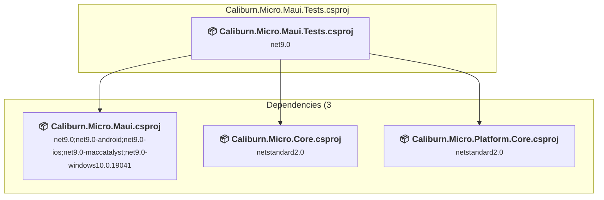

### API Compatibility

| Category | Count | Impact |
| :--- | :---: | :--- |
| 🔴 Binary Incompatible | 0 | High - Require code changes |
| 🟡 Source Incompatible | 38 | Medium - Needs re-compilation and potential conflicting API error fixing |
| 🔵 Behavioral change | 0 | Low - Behavioral changes that may require testing at runtime |
| ✅ Compatible | 479 |  |
| ***Total APIs Analyzed*** | ***517*** |  |

### Caliburn.Micro.Maui\Caliburn.Micro.Maui.csproj

#### Project Info

- **Current Target Framework:** net9.0;net9.0-android;net9.0-ios;net9.0-maccatalyst;net9.0-windows10.0.19041
- **Proposed Target Framework:** net9.0;net9.0-android;net9.0-ios;net9.0-maccatalyst;net9.0-windows10.0.19041;net10.0-windows
- **SDK-style**: True
- **Project Kind:** ClassLibrary
- **Dependencies**: 2
- **Dependants**: 1
- **Number of Files**: 30
- **Number of Files with Incidents**: 22
- **Lines of Code**: 5645
- **Estimated LOC to modify**: 515+ (at least 9.1% of the project)

#### Dependency Graph

Legend:
📦 SDK-style project
⚙️ Classic project

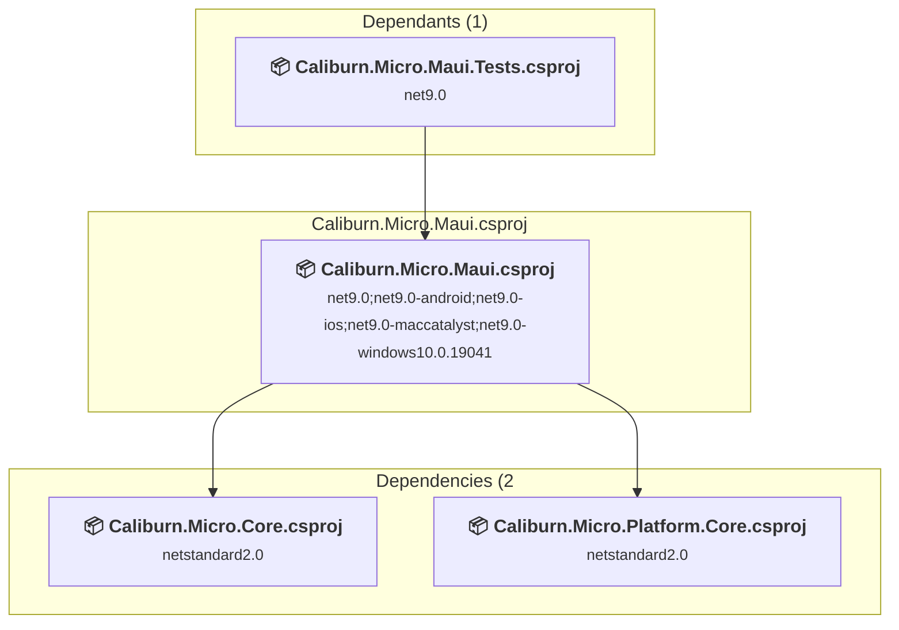

### API Compatibility

| Category | Count | Impact |
| :--- | :---: | :--- |
| 🔴 Binary Incompatible | 3 | High - Require code changes |
| 🟡 Source Incompatible | 510 | Medium - Needs re-compilation and potential conflicting API error fixing |
| 🔵 Behavioral change | 2 | Low - Behavioral changes that may require testing at runtime |
| ✅ Compatible | 1937 |  |
| ***Total APIs Analyzed*** | ***2452*** |  |

### Caliburn.Micro.Platform.Core\Caliburn.Micro.Platform.Core.csproj

#### Project Info

- **Current Target Framework:** netstandard2.0✅
- **SDK-style**: True
- **Project Kind:** ClassLibrary
- **Dependencies**: 1
- **Dependants**: 8
- **Number of Files**: 6
- **Lines of Code**: 579
- **Estimated LOC to modify**: 0+ (at least 0.0% of the project)

#### Dependency Graph

Legend:
📦 SDK-style project
⚙️ Classic project

```mermaid
flowchart TB
    subgraph upstream["Dependants (8)"]
        P2["<b>📦&nbsp;Caliburn.Micro.Platform.csproj</b><br/><small>net462;uap10.0.19041;net9.0-android;net9.0-ios;net8.0-windows;net9.0-windows</small>"]
        P4["<b>📦&nbsp;Caliburn.Micro.Platform.Tests.csproj</b><br/><small>net8.0-windows</small>"]
        P6["<b>📦&nbsp;Caliburn.Micro.Xamarin.Forms.csproj</b><br/><small>netstandard2.0</small>"]
        P7["<b>📦&nbsp;Caliburn.Micro.Maui.csproj</b><br/><small>net9.0;net9.0-android;net9.0-ios;net9.0-maccatalyst;net9.0-windows10.0.19041</small>"]
        P8["<b>📦&nbsp;Caliburn.Micro.Avalonia.csproj</b><br/><small>net8.0</small>"]
        P9["<b>📦&nbsp;Caliburn.Micro.Avalonia.Tests.csproj</b><br/><small>net8.0</small>"]
        P10["<b>📦&nbsp;Caliburn.Micro.Maui.Tests.csproj</b><br/><small>net9.0</small>"]
        P11["<b>📦&nbsp;Caliburn.Micro.WinUI3.csproj</b><br/><small>net9.0-windows10.0.19041.0;net10.0-windows10.0.19041.0</small>"]
        click P2 "#caliburnmicroplatformcaliburnmicroplatformcsproj"
        click P4 "#caliburnmicroplatformtestscaliburnmicroplatformtestscsproj"
        click P6 "#caliburnmicroxamarinformscaliburnmicroxamarinformscsproj"
        click P7 "#caliburnmicromauicaliburnmicromauicsproj"
        click P8 "#caliburnmicroavaloniacaliburnmicroavaloniacsproj"
        click P9 "#caliburnmicroavaloniatestscaliburnmicroavaloniatestscsproj"
        click P10 "#caliburnmicromauitestscaliburnmicromauitestscsproj"
        click P11 "#caliburnmicrowinui3caliburnmicrowinui3csproj"
    end
    subgraph current["Caliburn.Micro.Platform.Core.csproj"]
        MAIN["<b>📦&nbsp;Caliburn.Micro.Platform.Core.csproj</b><br/><small>netstandard2.0</small>"]
        click MAIN "#caliburnmicroplatformcorecaliburnmicroplatformcorecsproj"
    end
    subgraph downstream["Dependencies (1"]
        P1["<b>📦&nbsp;Caliburn.Micro.Core.csproj</b><br/><small>netstandard2.0</small>"]
        click P1 "#caliburnmicrocorecaliburnmicrocorecsproj"
    end
    P2 --> MAIN
    P4 --> MAIN
    P6 --> MAIN
    P7 --> MAIN
    P8 --> MAIN
    P9 --> MAIN
    P10 --> MAIN
    P11 --> MAIN
    MAIN --> P1

```

### API Compatibility

| Category | Count | Impact |
| :--- | :---: | :--- |
| 🔴 Binary Incompatible | 0 | High - Require code changes |
| 🟡 Source Incompatible | 0 | Medium - Needs re-compilation and potential conflicting API error fixing |
| 🔵 Behavioral change | 0 | Low - Behavioral changes that may require testing at runtime |
| ✅ Compatible | 224 |  |
| ***Total APIs Analyzed*** | ***224*** |  |

### Caliburn.Micro.Platform.Tests\Caliburn.Micro.Platform.Tests.csproj

#### Project Info

- **Current Target Framework:** net8.0-windows
- **Proposed Target Framework:** net10.0-windows
- **SDK-style**: True
- **Project Kind:** Wpf
- **Dependencies**: 3
- **Dependants**: 0
- **Number of Files**: 10
- **Number of Files with Incidents**: 3
- **Lines of Code**: 535
- **Estimated LOC to modify**: 73+ (at least 13.6% of the project)

#### Dependency Graph

Legend:
📦 SDK-style project
⚙️ Classic project

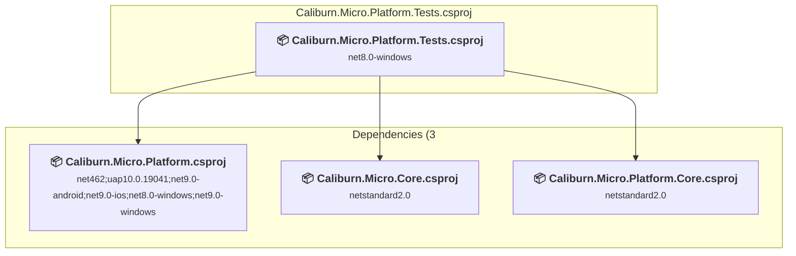

### API Compatibility

| Category | Count | Impact |
| :--- | :---: | :--- |
| 🔴 Binary Incompatible | 73 | High - Require code changes |
| 🟡 Source Incompatible | 0 | Medium - Needs re-compilation and potential conflicting API error fixing |
| 🔵 Behavioral change | 0 | Low - Behavioral changes that may require testing at runtime |
| ✅ Compatible | 417 |  |
| ***Total APIs Analyzed*** | ***490*** |  |

#### Project Technologies and Features

| Technology | Issues | Percentage | Migration Path |
| :--- | :---: | :---: | :--- |
| WPF (Windows Presentation Foundation) | 8 | 11.0% | WPF APIs for building Windows desktop applications with XAML-based UI that are available in .NET on Windows. WPF provides rich desktop UI capabilities with data binding and styling. Enable Windows Desktop support: Option 1 (Recommended): Target net9.0-windows; Option 2: Add <UseWindowsDesktop>true</UseWindowsDesktop>. |

### Caliburn.Micro.Platform\Caliburn.Micro.Platform.csproj

#### Project Info

- **Current Target Framework:** net462;uap10.0.19041;net9.0-android;net9.0-ios;net8.0-windows;net9.0-windows
- **Proposed Target Framework:** net462;uap10.0.19041;net9.0-android;net9.0-ios;net8.0-windows;net9.0-windows;net10.0-windows
- **SDK-style**: True
- **Project Kind:** Wpf
- **Dependencies**: 2
- **Dependants**: 1
- **Number of Files**: 29
- **Number of Files with Incidents**: 21
- **Lines of Code**: 7282
- **Estimated LOC to modify**: 969+ (at least 13.3% of the project)

#### Dependency Graph

Legend:
📦 SDK-style project
⚙️ Classic project

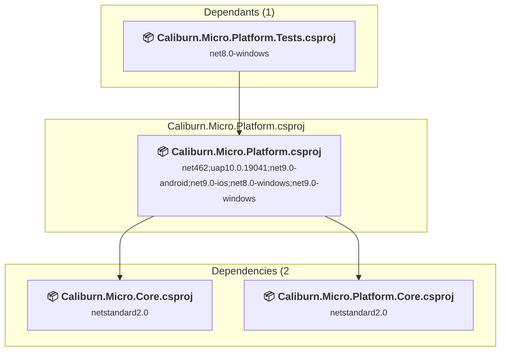

### API Compatibility

| Category | Count | Impact |
| :--- | :---: | :--- |
| 🔴 Binary Incompatible | 956 | High - Require code changes |
| 🟡 Source Incompatible | 0 | Medium - Needs re-compilation and potential conflicting API error fixing |
| 🔵 Behavioral change | 13 | Low - Behavioral changes that may require testing at runtime |
| ✅ Compatible | 2177 |  |
| ***Total APIs Analyzed*** | ***3146*** |  |

#### Project Technologies and Features

| Technology | Issues | Percentage | Migration Path |
| :--- | :---: | :---: | :--- |
| WPF (Windows Presentation Foundation) | 380 | 39.2% | WPF APIs for building Windows desktop applications with XAML-based UI that are available in .NET on Windows. WPF provides rich desktop UI capabilities with data binding and styling. Enable Windows Desktop support: Option 1 (Recommended): Target net9.0-windows; Option 2: Add <UseWindowsDesktop>true</UseWindowsDesktop>. |

### Caliburn.Micro.WinUI3\Caliburn.Micro.WinUI3.csproj

#### Project Info

- **Current Target Framework:** net9.0-windows10.0.19041.0;net10.0-windows10.0.19041.0
- **Proposed Target Framework:** net9.0-windows10.0.19041.0;net10.0-windows10.0.19041.0;net10.0-windows10.0.22000.0
- **SDK-style**: True
- **Project Kind:** WinUI
- **Dependencies**: 2
- **Dependants**: 0
- **Number of Files**: 37
- **Number of Files with Incidents**: 4
- **Lines of Code**: 8718
- **Estimated LOC to modify**: 30+ (at least 0.3% of the project)

#### Dependency Graph

Legend:
📦 SDK-style project
⚙️ Classic project

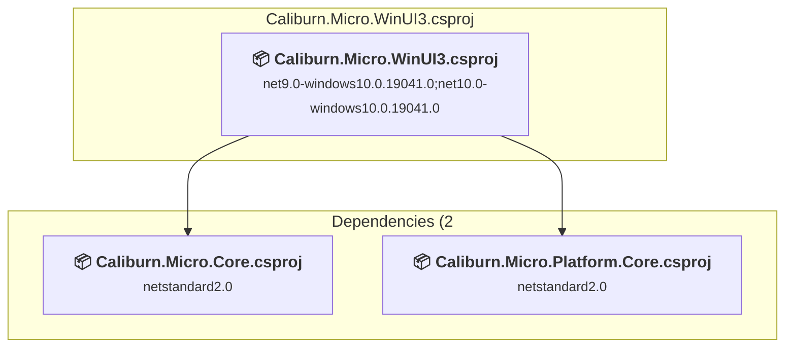

### API Compatibility

| Category | Count | Impact |
| :--- | :---: | :--- |
| 🔴 Binary Incompatible | 0 | High - Require code changes |
| 🟡 Source Incompatible | 10 | Medium - Needs re-compilation and potential conflicting API error fixing |
| 🔵 Behavioral change | 20 | Low - Behavioral changes that may require testing at runtime |
| ✅ Compatible | 3875 |  |
| ***Total APIs Analyzed*** | ***3905*** |  |

### Caliburn.Micro.Xamarin.Forms\Caliburn.Micro.Xamarin.Forms.csproj

#### Project Info

- **Current Target Framework:** netstandard2.0✅
- **SDK-style**: True
- **Project Kind:** ClassLibrary
- **Dependencies**: 2
- **Dependants**: 0
- **Number of Files**: 30
- **Number of Files with Incidents**: 2
- **Lines of Code**: 5599
- **Estimated LOC to modify**: 2+ (at least 0.0% of the project)

#### Dependency Graph

Legend:
📦 SDK-style project
⚙️ Classic project

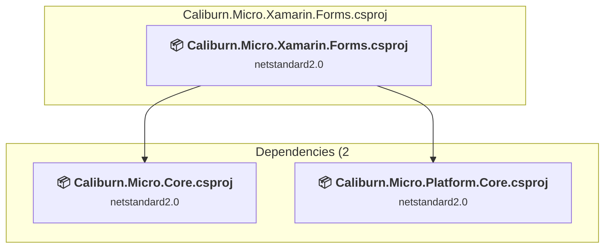

### API Compatibility

| Category | Count | Impact |
| :--- | :---: | :--- |
| 🔴 Binary Incompatible | 0 | High - Require code changes |
| 🟡 Source Incompatible | 0 | Medium - Needs re-compilation and potential conflicting API error fixing |
| 🔵 Behavioral change | 2 | Low - Behavioral changes that may require testing at runtime |
| ✅ Compatible | 2241 |  |
| ***Total APIs Analyzed*** | ***2243*** |  |

