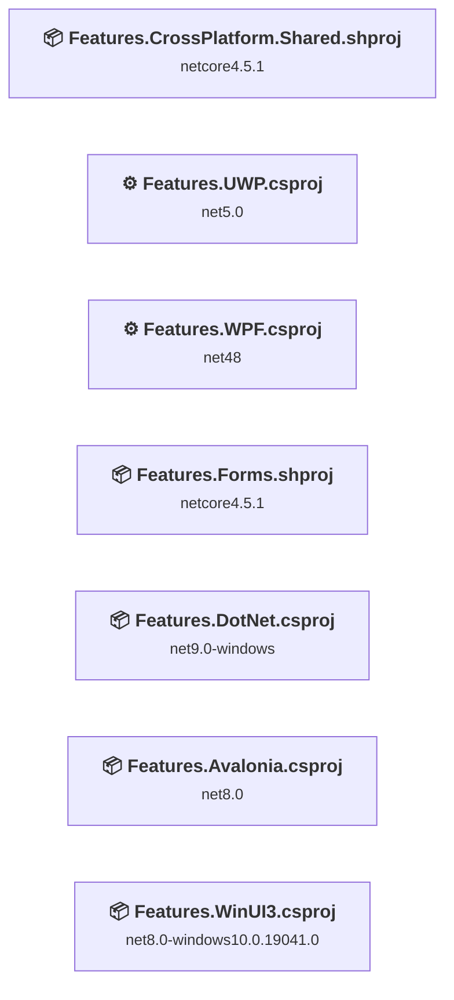
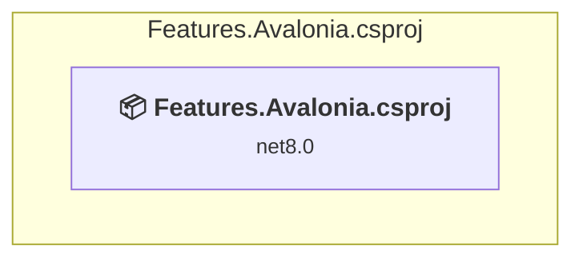
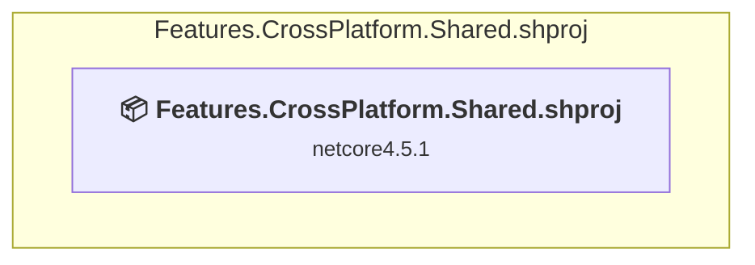
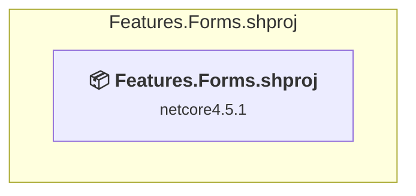
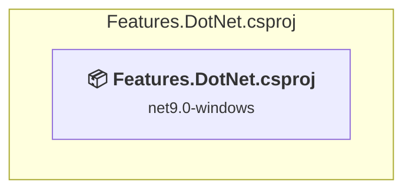
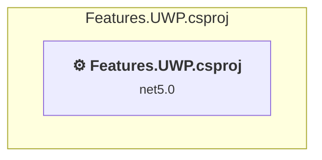
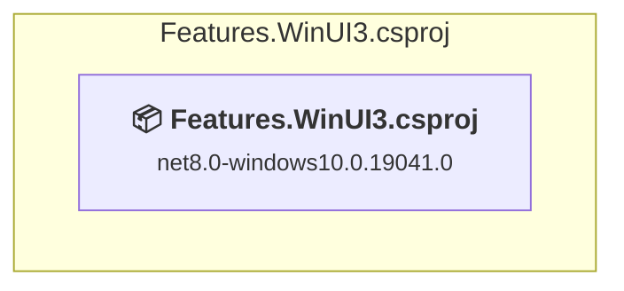
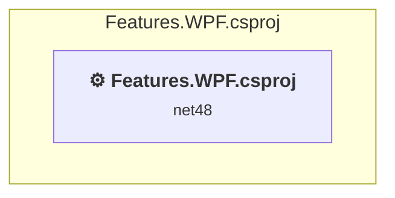

# Projects and dependencies analysis

This document provides a comprehensive overview of the projects and their dependencies in the context of upgrading to .NETCoreApp,Version=v10.0.

## Table of Contents

- [Executive Summary](#executive-Summary)
  - [Highlevel Metrics](#highlevel-metrics)
  - [Projects Compatibility](#projects-compatibility)
  - [Package Compatibility](#package-compatibility)
  - [API Compatibility](#api-compatibility)
- [Aggregate NuGet packages details](#aggregate-nuget-packages-details)
- [Top API Migration Challenges](#top-api-migration-challenges)
  - [Technologies and Features](#technologies-and-features)
  - [Most Frequent API Issues](#most-frequent-api-issues)
- [Projects Relationship Graph](#projects-relationship-graph)
- [Project Details](#project-details)

  - [Features.Avalonia\Features.Avalonia.csproj](#featuresavaloniafeaturesavaloniacsproj)
  - [Features.CrossPlatform.Shared\Features.CrossPlatform.Shared.shproj](#featurescrossplatformsharedfeaturescrossplatformsharedshproj)
  - [Features.Forms\Features.Forms\Features.Forms.shproj](#featuresformsfeaturesformsfeaturesformsshproj)
  - [Features.NetFive\Features.DotNet.csproj](#featuresnetfivefeaturesdotnetcsproj)
  - [Features.UWP\Features.UWP.csproj](#featuresuwpfeaturesuwpcsproj)
  - [Features.WinUI3\Features.WinUI3.csproj](#featureswinui3featureswinui3csproj)
  - [Features.WPF\Features.WPF.csproj](#featureswpffeatureswpfcsproj)

## Executive Summary

### Highlevel Metrics

| Metric | Count | Status |
| :--- | :---: | :--- |
| Total Projects | 7 | All require upgrade |
| Total NuGet Packages | 36 | 4 need upgrade |
| Total Code Files | 279 |  |
| Total Code Files with Incidents | 7 |  |
| Total Lines of Code | 8106 |  |
| Total Number of Issues | 35 |  |
| Estimated LOC to modify | 0+ | at least 0.0% of codebase |

### Projects Compatibility

| Project | Target Framework | Difficulty | Package Issues | API Issues | Est. LOC Impact | Description |
| :--- | :---: | :---: | :---: | :---: | :---: | :--- |
| [Features.Avalonia\Features.Avalonia.csproj](#featuresavaloniafeaturesavaloniacsproj) | net8.0 | 🟢 Low | 0 | 0 |  | WinForms, Sdk Style = True |
| [Features.CrossPlatform.Shared\Features.CrossPlatform.Shared.shproj](#featurescrossplatformsharedfeaturescrossplatformsharedshproj) | netcore4.5.1 | 🟢 Low | 0 | 0 |  | DotNetCoreApp, Sdk Style = True |
| [Features.Forms\Features.Forms\Features.Forms.shproj](#featuresformsfeaturesformsfeaturesformsshproj) | netcore4.5.1 | 🟢 Low | 0 | 0 |  | DotNetCoreApp, Sdk Style = True |
| [Features.NetFive\Features.DotNet.csproj](#featuresnetfivefeaturesdotnetcsproj) | net9.0-windows | 🟢 Low | 1 | 0 |  | Wpf, Sdk Style = True |
| [Features.UWP\Features.UWP.csproj](#featuresuwpfeaturesuwpcsproj) | net5.0 | 🟢 Low | 2 | 0 |  | Uwp, Sdk Style = False |
| [Features.WinUI3\Features.WinUI3.csproj](#featureswinui3featureswinui3csproj) | net8.0-windows10.0.19041.0 | 🟢 Low | 2 | 0 |  | WinForms, Sdk Style = True |
| [Features.WPF\Features.WPF.csproj](#featureswpffeatureswpfcsproj) | net48 | 🟢 Low | 21 | 0 |  | ClassicWpf, Sdk Style = False |

### Package Compatibility

| Status | Count | Percentage |
| :--- | :---: | :---: |
| ✅ Compatible | 32 | 88.9% |
| ⚠️ Incompatible | 4 | 11.1% |
| 🔄 Upgrade Recommended | 0 | 0.0% |
| ***Total NuGet Packages*** | ***36*** | ***100%*** |

### API Compatibility

| Category | Count | Impact |
| :--- | :---: | :--- |
| 🔴 Binary Incompatible | 0 | High - Require code changes |
| 🟡 Source Incompatible | 0 | Medium - Needs re-compilation and potential conflicting API error fixing |
| 🔵 Behavioral change | 0 | Low - Behavioral changes that may require testing at runtime |
| ✅ Compatible | 0 |  |
| ***Total APIs Analyzed*** | ***0*** |  |

## Aggregate NuGet packages details

| Package | Current Version | Suggested Version | Projects | Description |
| :--- | :---: | :---: | :--- | :--- |
| Avalonia | 11.3.5 |  | [Features.Avalonia.csproj](#featuresavaloniafeaturesavaloniacsproj) | ✅Compatible |
| Avalonia.Desktop | 11.3.5 |  | [Features.Avalonia.csproj](#featuresavaloniafeaturesavaloniacsproj) | ✅Compatible |
| Avalonia.Diagnostics | 11.3.5 |  | [Features.Avalonia.csproj](#featuresavaloniafeaturesavaloniacsproj) | ✅Compatible |
| Avalonia.Markup.Xaml.Loader | 11.3.5 |  | [Features.Avalonia.csproj](#featuresavaloniafeaturesavaloniacsproj) | ✅Compatible |
| Avalonia.Themes.FLuent | 11.3.5 |  | [Features.Avalonia.csproj](#featuresavaloniafeaturesavaloniacsproj) | ✅Compatible |
| MessageBox.Avalonia | 3.2.0 |  | [Features.Avalonia.csproj](#featuresavaloniafeaturesavaloniacsproj) | ✅Compatible |
| Microsoft.NETCore.Platforms | 7.0.4 |  | [Features.WPF.csproj](#featureswpffeatureswpfcsproj) | NuGet package functionality is included with framework reference |
| Microsoft.NETCore.UniversalWindowsPlatform | 6.2.14 |  | [Features.UWP.csproj](#featuresuwpfeaturesuwpcsproj) | Needs to be replaced with Replace with new package Microsoft.WindowsAppSDK=2.0.1;Microsoft.Graphics.Win2D=1.1.0;Microsoft.Windows.Compatibility=10.0.7 |
| Microsoft.Win32.Primitives | 4.3.0 |  | [Features.WPF.csproj](#featureswpffeatureswpfcsproj) | NuGet package functionality is included with framework reference |
| Microsoft.Windows.SDK.BuildTools | 10.0.26100.1742 |  | [Features.WinUI3.csproj](#featureswinui3featureswinui3csproj) | ✅Compatible |
| Microsoft.WindowsAppSDK | 1.6.241114003 | 2.0.1 | [Features.WinUI3.csproj](#featureswinui3featureswinui3csproj) | ⚠️NuGet package is incompatible |
| Microsoft.Xaml.Behaviors.Uwp.Managed | 2.0.1 |  | [Features.UWP.csproj](#featuresuwpfeaturesuwpcsproj) | ⚠️NuGet package is incompatible |
| Microsoft.Xaml.Behaviors.WinUI.Managed | 2.0.9 |  | [Features.WinUI3.csproj](#featureswinui3featureswinui3csproj) | ⚠️NuGet package is incompatible |
| Microsoft.Xaml.Behaviors.Wpf | 1.1.135 | 1.1.39 | [Features.DotNet.csproj](#featuresnetfivefeaturesdotnetcsproj) [Features.WPF.csproj](#featureswpffeatureswpfcsproj) | ⚠️NuGet package is incompatible |
| NETStandard.Library | 2.0.3 |  | [Features.WPF.csproj](#featureswpffeatureswpfcsproj) | NuGet package functionality is included with framework reference |
| System.AppContext | 4.3.0 |  | [Features.WPF.csproj](#featureswpffeatureswpfcsproj) | NuGet package functionality is included with framework reference |
| System.Console | 4.3.1 |  | [Features.WPF.csproj](#featureswpffeatureswpfcsproj) | NuGet package functionality is included with framework reference |
| System.Globalization.Calendars | 4.3.0 |  | [Features.WPF.csproj](#featureswpffeatureswpfcsproj) | NuGet package functionality is included with framework reference |
| System.IO | 4.3.0 |  | [Features.WPF.csproj](#featureswpffeatureswpfcsproj) | NuGet package functionality is included with framework reference |
| System.IO.Compression | 4.3.0 |  | [Features.WPF.csproj](#featureswpffeatureswpfcsproj) | NuGet package functionality is included with framework reference |
| System.IO.Compression.ZipFile | 4.3.0 |  | [Features.WPF.csproj](#featureswpffeatureswpfcsproj) | NuGet package functionality is included with framework reference |
| System.IO.FileSystem | 4.3.0 |  | [Features.WPF.csproj](#featureswpffeatureswpfcsproj) | NuGet package functionality is included with framework reference |
| System.IO.FileSystem.Primitives | 4.3.0 |  | [Features.WPF.csproj](#featureswpffeatureswpfcsproj) | NuGet package functionality is included with framework reference |
| System.Net.Http | 4.3.4 |  | [Features.WPF.csproj](#featureswpffeatureswpfcsproj) | NuGet package functionality is included with framework reference |
| System.Net.Sockets | 4.3.0 |  | [Features.WPF.csproj](#featureswpffeatureswpfcsproj) | NuGet package functionality is included with framework reference |
| System.Reactive | 6.0.1 |  | [Features.Avalonia.csproj](#featuresavaloniafeaturesavaloniacsproj) | ✅Compatible |
| System.Runtime | 4.3.1 |  | [Features.WPF.csproj](#featureswpffeatureswpfcsproj) | NuGet package functionality is included with framework reference |
| System.Runtime.InteropServices.RuntimeInformation | 4.3.0 |  | [Features.WPF.csproj](#featureswpffeatureswpfcsproj) | NuGet package functionality is included with framework reference |
| System.Security.Cryptography.Algorithms | 4.3.1 |  | [Features.WPF.csproj](#featureswpffeatureswpfcsproj) | NuGet package functionality is included with framework reference |
| System.Security.Cryptography.Encoding | 4.3.0 |  | [Features.WPF.csproj](#featureswpffeatureswpfcsproj) | NuGet package functionality is included with framework reference |
| System.Security.Cryptography.Primitives | 4.3.0 |  | [Features.WPF.csproj](#featureswpffeatureswpfcsproj) | NuGet package functionality is included with framework reference |
| System.Security.Cryptography.X509Certificates | 4.3.2 |  | [Features.WPF.csproj](#featureswpffeatureswpfcsproj) | NuGet package functionality is included with framework reference |
| System.Xml.ReaderWriter | 4.3.1 |  | [Features.WPF.csproj](#featureswpffeatureswpfcsproj) | NuGet package functionality is included with framework reference |
| Xaml.Behaviors.Avalonia | 11.3.2 |  | [Features.Avalonia.csproj](#featuresavaloniafeaturesavaloniacsproj) | ✅Compatible |
| Xaml.Behaviors.Interactivity | 11.3.2 |  | [Features.Avalonia.csproj](#featuresavaloniafeaturesavaloniacsproj) | ✅Compatible |
| XamlNameReferenceGenerator | 1.6.1 |  | [Features.Avalonia.csproj](#featuresavaloniafeaturesavaloniacsproj) | ✅Compatible |

## Top API Migration Challenges

### Technologies and Features

| Technology | Issues | Percentage | Migration Path |
| :--- | :---: | :---: | :--- |

### Most Frequent API Issues

| API | Count | Percentage | Category |
| :--- | :---: | :---: | :--- |

## Projects Relationship Graph

Legend:
📦 SDK-style project
⚙️ Classic project

## Project Details

### Features.Avalonia\Features.Avalonia.csproj

#### Project Info

- **Current Target Framework:** net8.0
- **Proposed Target Framework:** net10.0-windows
- **SDK-style**: True
- **Project Kind:** WinForms
- **Dependencies**: 0
- **Dependants**: 0
- **Number of Files**: 50
- **Number of Files with Incidents**: 1
- **Lines of Code**: 1378
- **Estimated LOC to modify**: 0+ (at least 0.0% of the project)

#### Dependency Graph

Legend:
📦 SDK-style project
⚙️ Classic project

### API Compatibility

| Category | Count | Impact |
| :--- | :---: | :--- |
| 🔴 Binary Incompatible | 0 | High - Require code changes |
| 🟡 Source Incompatible | 0 | Medium - Needs re-compilation and potential conflicting API error fixing |
| 🔵 Behavioral change | 0 | Low - Behavioral changes that may require testing at runtime |
| ✅ Compatible | 0 |  |
| ***Total APIs Analyzed*** | ***0*** |  |

### Features.CrossPlatform.Shared\Features.CrossPlatform.Shared.shproj

#### Project Info

- **Current Target Framework:** netcore4.5.1
- **Proposed Target Framework:** net10.0
- **SDK-style**: True
- **Project Kind:** DotNetCoreApp
- **Dependencies**: 0
- **Dependants**: 0
- **Number of Files**: 25
- **Number of Files with Incidents**: 1
- **Lines of Code**: 821
- **Estimated LOC to modify**: 0+ (at least 0.0% of the project)

#### Dependency Graph

Legend:
📦 SDK-style project
⚙️ Classic project

### API Compatibility

| Category | Count | Impact |
| :--- | :---: | :--- |
| 🔴 Binary Incompatible | 0 | High - Require code changes |
| 🟡 Source Incompatible | 0 | Medium - Needs re-compilation and potential conflicting API error fixing |
| 🔵 Behavioral change | 0 | Low - Behavioral changes that may require testing at runtime |
| ✅ Compatible | 0 |  |
| ***Total APIs Analyzed*** | ***0*** |  |

### Features.Forms\Features.Forms\Features.Forms.shproj

#### Project Info

- **Current Target Framework:** netcore4.5.1
- **Proposed Target Framework:** net10.0
- **SDK-style**: True
- **Project Kind:** DotNetCoreApp
- **Dependencies**: 0
- **Dependants**: 0
- **Number of Files**: 33
- **Number of Files with Incidents**: 1
- **Lines of Code**: 234
- **Estimated LOC to modify**: 0+ (at least 0.0% of the project)

#### Dependency Graph

Legend:
📦 SDK-style project
⚙️ Classic project

### API Compatibility

| Category | Count | Impact |
| :--- | :---: | :--- |
| 🔴 Binary Incompatible | 0 | High - Require code changes |
| 🟡 Source Incompatible | 0 | Medium - Needs re-compilation and potential conflicting API error fixing |
| 🔵 Behavioral change | 0 | Low - Behavioral changes that may require testing at runtime |
| ✅ Compatible | 0 |  |
| ***Total APIs Analyzed*** | ***0*** |  |

### Features.NetFive\Features.DotNet.csproj

#### Project Info

- **Current Target Framework:** net9.0-windows
- **Proposed Target Framework:** net10.0-windows
- **SDK-style**: True
- **Project Kind:** Wpf
- **Dependencies**: 0
- **Dependants**: 0
- **Number of Files**: 50
- **Number of Files with Incidents**: 1
- **Lines of Code**: 1498
- **Estimated LOC to modify**: 0+ (at least 0.0% of the project)

#### Dependency Graph

Legend:
📦 SDK-style project
⚙️ Classic project

### API Compatibility

| Category | Count | Impact |
| :--- | :---: | :--- |
| 🔴 Binary Incompatible | 0 | High - Require code changes |
| 🟡 Source Incompatible | 0 | Medium - Needs re-compilation and potential conflicting API error fixing |
| 🔵 Behavioral change | 0 | Low - Behavioral changes that may require testing at runtime |
| ✅ Compatible | 0 |  |
| ***Total APIs Analyzed*** | ***0*** |  |

### Features.UWP\Features.UWP.csproj

#### Project Info

- **Current Target Framework:** net5.0
- **Proposed Target Framework:** net10.0-windows10.0.22000.0
- **SDK-style**: False
- **Project Kind:** Uwp
- **Dependencies**: 0
- **Dependants**: 0
- **Number of Files**: 52
- **Number of Files with Incidents**: 1
- **Lines of Code**: 1164
- **Estimated LOC to modify**: 0+ (at least 0.0% of the project)

#### Dependency Graph

Legend:
📦 SDK-style project
⚙️ Classic project

### API Compatibility

| Category | Count | Impact |
| :--- | :---: | :--- |
| 🔴 Binary Incompatible | 0 | High - Require code changes |
| 🟡 Source Incompatible | 0 | Medium - Needs re-compilation and potential conflicting API error fixing |
| 🔵 Behavioral change | 0 | Low - Behavioral changes that may require testing at runtime |
| ✅ Compatible | 0 |  |
| ***Total APIs Analyzed*** | ***0*** |  |

### Features.WinUI3\Features.WinUI3.csproj

#### Project Info

- **Current Target Framework:** net8.0-windows10.0.19041.0
- **Proposed Target Framework:** net10.0-windows10.0.22000.0
- **SDK-style**: True
- **Project Kind:** WinForms
- **Dependencies**: 0
- **Dependants**: 0
- **Number of Files**: 60
- **Number of Files with Incidents**: 1
- **Lines of Code**: 1579
- **Estimated LOC to modify**: 0+ (at least 0.0% of the project)

#### Dependency Graph

Legend:
📦 SDK-style project
⚙️ Classic project

### API Compatibility

| Category | Count | Impact |
| :--- | :---: | :--- |
| 🔴 Binary Incompatible | 0 | High - Require code changes |
| 🟡 Source Incompatible | 0 | Medium - Needs re-compilation and potential conflicting API error fixing |
| 🔵 Behavioral change | 0 | Low - Behavioral changes that may require testing at runtime |
| ✅ Compatible | 0 |  |
| ***Total APIs Analyzed*** | ***0*** |  |

### Features.WPF\Features.WPF.csproj

#### Project Info

- **Current Target Framework:** net48
- **Proposed Target Framework:** net10.0-windows
- **SDK-style**: False
- **Project Kind:** ClassicWpf
- **Dependencies**: 0
- **Dependants**: 0
- **Number of Files**: 50
- **Number of Files with Incidents**: 1
- **Lines of Code**: 1432
- **Estimated LOC to modify**: 0+ (at least 0.0% of the project)

#### Dependency Graph

Legend:
📦 SDK-style project
⚙️ Classic project

### API Compatibility

| Category | Count | Impact |
| :--- | :---: | :--- |
| 🔴 Binary Incompatible | 0 | High - Require code changes |
| 🟡 Source Incompatible | 0 | Medium - Needs re-compilation and potential conflicting API error fixing |
| 🔵 Behavioral change | 0 | Low - Behavioral changes that may require testing at runtime |
| ✅ Compatible | 0 |  |
| ***Total APIs Analyzed*** | ***0*** |  |

